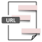

#  Url2Label by tfidf APIs **flow**ground Connector

## Description

A generated **flow**ground connector for the Url2Label by tfidf APIs API (version 0.0.1).

Generated from: https://api.apis.guru/v2/specs/apitore.com/url2labelByTfidfApis/0.0.1/swagger.json 
Generated at: 2019-05-07T17:36:51+03:00

## API Description

Url to label by tfidf of contents. [Endpoint] https://api.apitore.com/api/20

## Authorization

This API does not require authorization.

## Actions

### Get labels from URL

> Url2Label by tfidf. Response &nbsp; Github: <a href="https://github.com/keigohtr/apitore-response-parent/tree/master/summarize-response">summarize-response</a> &nbsp; Class: com.apitore.banana.response.summarize.LabelResponseEntity 

*Tags:* `url-2-label-by-tfidf-controller`

#### Input Parameters
* `access_token` - _required_ - Access Token
* `url` - _required_ - url
* `num` - _optional_ - num [max 10, default 1]

## License

**flow**ground :- Telekom iPaaS / apitore-com-url-2-label-by-tfidf-apis-connector 
Copyright © 2019, [Deutsche Telekom AG](https://www.telekom.de) 
contact: flowground@telekom.de

All files of this connector are licensed under the Apache 2.0 License. For details
see the file LICENSE on the toplevel directory.
